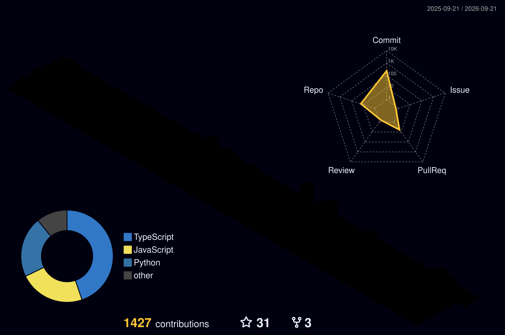

<h1 align="center">Arun Kumar</h1>
<h3 align="center">Fullstack Developer · React · React Native · Node.js · AI-Integrated Apps</h3>
<h4 align="center">8+ Years Experience · Top Rated Plus on Upwork</h4>

  <a href="mailto:arun.etech2011@gmail.com">Email</a> ·
  <a href="http://bit.ly/3CMp7Tf">Upwork</a> ·
  <a href="https://github.com/arun-kumar-codes">GitHub</a>

  

  
  
  
  

---

### About

Fullstack developer with **8+ years of experience**, currently freelancing as a **Top Rated Plus** engineer on Upwork (100% Job Success, 4.9/5 across 61 reviews, 81 completed jobs, 19K+ hours logged, $300K+ earned).

I build production web and mobile applications end to end — React/Next.js frontends, Node.js/Express backends, and mobile apps in React Native — and have shipped several projects with AI-integrated features (automated ordering chatbots, AI-assisted SaaS workflows).

- 🎓 B.Tech in Computer Science
- 🏢 Excellence Technosoft Pvt Ltd
- 💼 Available full-time (40–50 hrs/week), open to long-term and SaaS/enterprise engagements
- 📫 **arun.etech2011@gmail.com**

---

### Skills

**Frontend**
`React` `Redux` `Next.js` `Vue.js` `Nuxt.js` `TypeScript` `JavaScript (ES6+)` `HTML5` `CSS3` `Tailwind CSS`

**Backend**
`Node.js` `Express.js` `GraphQL` `REST APIs` `Python`

**Mobile**
`React Native`

**Databases**
`MongoDB` `MySQL` `PostgreSQL`

**Cloud & AI**
`AWS` `AI Development` `Chatbot Integration` `AI-Powered SaaS Workflows`

   
   
  

---

### Recent Work (Upwork)

<!-- TODO: these are pulled from your Upwork history -- rewrite the client's line into 1
     sentence on what YOU did / delivered, once you've picked which projects to feature. -->

- **Senior Frontend Engineer** -- Built a PWA platform (mobile + browser) from scaffold to production. `React · JavaScript · HTML`
- **MVP Code Review & Optimization** -- Reviewed and optimized an existing MVP application. `React · Next.js · Node.js · PostgreSQL · Python · AWS`
- **AI-Powered Event Planning SaaS** -- Contributed to an AI-assisted event-planning platform, including a web push notification service worker. `React Native · API`
- **AI Ordering App (Chatbot)** -- Reviewed and completed a partially built SMS-based AI ordering application with chatbot integration. `Node.js · Firebase · Chatbot Training`
- **Full Stack JavaScript (MEVN)** -- Built a business application on Vue/Nuxt/Express/MongoDB. `Vue.js · Nuxt.js · Node.js · MongoDB · MySQL`

[See full work history on Upwork →](http://bit.ly/3CMp7Tf)

---

### Featured GitHub Projects

**exo_quickplan** -- Relay + GraphQL fullstack scaffold for bootstrapping projects without re-wiring boilerplate each time.
`Relay · GraphQL · Node.js`

**HRrecruitapp** -- End-to-end recruitment workflow app covering the candidate pipeline from application to hire.
`React · Node.js`

**cloud_contact** -- Cloud contact manager with auth and CRUD contact management.
`React · Redux · Express · MongoDB`

**travel_yari** -- MERN travel booking platform.
`React · Node.js · MongoDB`

[See all pinned repos →](https://github.com/arun-kumar-codes)

---

### GitHub Activity

  
  

Contribution snake

  

3D contribution graph

  

*(Both generated automatically -- see `snake.yml` and `profile-3d.yml` workflows.)*

---

### Organizations

@akkohq · @OkwiLtd · @cryptocurrentllc · @indivatools · @EX3-Development · @car-atlas · @RiskSolutions3000

---

Open to remote roles, freelance, and long-term engagements.

